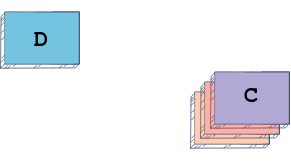

# Cấu trúc dữ liệu và giải thuật trong Python

## Introduction

Chào mừng bạn đến với lĩnh vực Cấu trúc dữ liệu và Giải thuật!

Khóa học này được thiết kế dành cho những người học cần chuẩn bị cho các cuộc phỏng vấn và trau dồi kỹ năng giải quyết vấn đề của mình, đặc biệt là về Cấu trúc dữ liệu và Giải thuật trong Python.

Bạn sẽ tìm thấy phần giới thiệu cơ bản và một số thách thức đối với các cấu trúc dữ liệu sau:

- Ngăn xếp (Stack)
- Danh sách liên kết đơn (Singly Linked Lists)
- Danh sách liên kết vòng (Circular Linked Lists)
- Danh sách liên kết đôi (Doubly Linked Lists)
- Mảng (Arrays)
- Cây nhị phân (Binary Tree)
- Cây nhị phân tìm kiếm (Binary Search Trees)

Ngoài ra, khóa học còn chứa nhiều vấn đề và giải pháp liên quan đến các thuật toán và kỹ thuật sau:

- Tìm kiếm nhị phân (Binary Search)
- Đệ quy (Recursion)
- Xử lý chuỗi (String Processing)

Xin lưu ý rằng khóa học này yêu cầu kiến ​​thức cơ bản về Python.

Bắt đầu nào! Tôi hy vọng bạn có trải nghiệm tuyệt vời giúp nâng cao kỹ năng giải quyết vấn đề của bạn về cấu trúc dữ liệu và thuật toán trong Python.

## Stack

Trong bài học này, chúng ta sẽ đi xem xét cấu trúc dữ liệu ngăn xếp và việc triển khai nó bằng Python.

Trong các bài học tiếp theo, chúng tôi sẽ cung cấp các vấn đề cụ thể trong đó ngăn xếp đặc biệt hữu ích. Chúng ta sẽ sử dụng cách triển khai mà chúng ta đã phát triển trong bài học này để giải quyết những vấn đề đó.

### Ngăn xếp là gì?

Trước hết hãy để tôi mô tả ngăn xếp là gì. Dựa trên cái tên, nó hẳn là một khái niệm tương đối quen thuộc.

Giả sử chúng ta có bốn cuốn sách với tựa đề hấp dẫn sau:

- A
- B
- C
- D

Hiện tại, những cuốn sách này đang được rải rác khắp sàn và chúng ta muốn xếp chúng lại cho gọn gàng.

| Bốn cuốn sách nằm ở khắp nơi | Chúng tôi lấy cuốn sách A và đặt nó xuống | Chúng ta quay lại đống sách của mình, lấy Quyển B và đặt nó lên trên chồng sách | Chúng tôi lấy Quyển C, đặt nó lên cuốn B và chúng tôi gần như đã dọn dẹp xong! | Bây giờ chúng ta lấy Quyển D và đặt nó lên trên Quyển C. |
| :--------------------------: | :---------------------------------------: | :-----------------------------------------------------------------------------: | :----------------------------------------------------------------------------: | :------------------------------------------------------: |
|           |                     |                                                            |                                                          |                                     |

Bây giờ chúng ta đã có một chồng sách đẹp đẽ và gọn gàng! Nếu chúng ta muốn lấy một cuốn sách từ ngăn xếp này, chúng ta có thể đưa cuốn sách lên trên. Việc lấy một cuốn sách từ dưới lên hơi bấp bênh và chúng ta không muốn lật đổ toàn bộ chồng sách. Do đó, chúng ta sẽ lấy cuốn sách trên cùng xuống và đọc nó hoặc làm bất cứ điều gì chúng ta muốn với nó.

Giả sử chúng ta muốn lấy Quyển A . Hiện tại, nó đang ở cuối ngăn xếp nên chúng ta cần lấy Quyển D , đặt nó xuống, sau đó làm tương tự cho Quyển C và Quyển B , sau đó chúng ta có thể truy cập Quyển A.

Đây là ý tưởng chính của ngăn xếp. Ngăn xếp cấu trúc dữ liệu rất giống với ngăn xếp vật lý mà bạn có thể quen thuộc nhất. Cấu trúc dữ liệu ngăn xếp cho phép chúng ta đặt bất kỳ tạo phẩm, biến hoặc đối tượng lập trình nào lên đó, giống như ngăn xếp ví dụ của chúng ta cho phép chúng ta đặt sách vào đó.

### Hoạt động ngăn xếp

#### Push

Thao tác chèn các phần tử vào ngăn xếp được gọi là push . Khi chúng ta đẩy cuốn sách lên một chồng, chúng ta đặt cuốn sách lên phần tử trên cùng trước đó , điều đó có nghĩa là cuốn sách mới trở thành phần tử trên cùng . Đây là ý nghĩa của chúng tôi khi sử dụng thao tác đẩy , chúng tôi đẩy các phần tử vào ngăn xếp. Chúng ta chèn các phần tử vào ngăn xếp và phần tử cuối cùng được đẩy lên trên cùng mới của ngăn xếp.

## Singly Linked Lists

## Circular Linked Lists

## Doubly Linked Lists

## Arrays

## Binary Tree

## Binary Search Trees

## Binary Search

## Recursion

## String Processing
